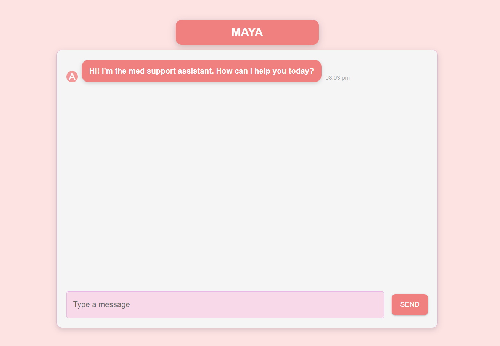
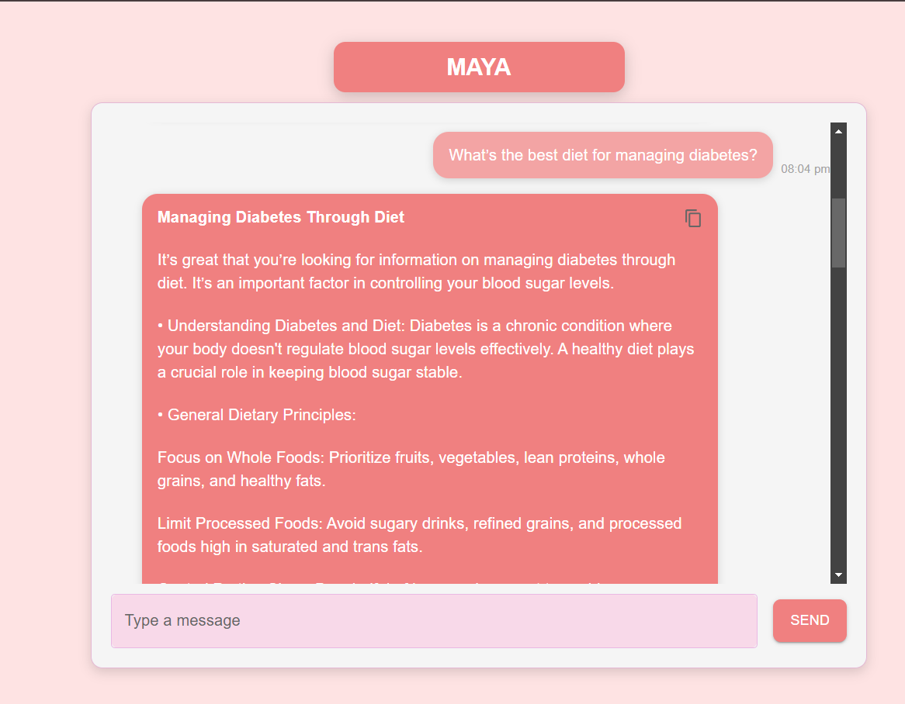

# Women's Health Assistant Chatbot 

This is a [Next.js](https://nextjs.org) project bootstrapped with [`create-next-app`](https://nextjs.org/docs/app/api-reference/cli/create-next-app). The **Women's Health Assistant Chatbot** is an intelligent, AI-powered chatbot designed to help track, analyze, and provide personalized insights on women's health across various life stages.

## ✨ Features

- 🩺 **Health Tracking & Analysis** – Track health data efficiently with personalized insights.
- 🤖 **AI-Powered** – Leverage AI for tailored health recommendations and analysis.
- 💬 **NLP-Based Chatbot** – Engage in meaningful conversations with our chatbot for personalized support.
- ⚡ **Optimized with Next.js** – Fast, scalable, and performance-driven web application.

## 🌐 Try the Chatbot

You can interact with the deployed chatbot by visiting the following link: [Women's Health Assistant Chatbot](https://ai-women-health-assisstant.vercel.app/).

## 🚀 Getting Started

Follow these steps to run the project locally:


1. **Install dependencies**:

   ```bash
   npm install
   # or
   yarn install
   ```

2. **Run the development server**:

   ```bash
   npm run dev
   # or
   yarn dev
   ```

4. **Open your browser**:
   Navigate to [http://localhost:3000](http://localhost:3000) to view the application.

You can start editing the page by modifying `app/page.js`. The page auto-updates as you edit the file.

## 🖼️ Screenshots


&nbsp;


&nbsp;



## 🛠️ Deployment

The chatbot is deployed using [Vercel](https://vercel.com). For detailed instructions on how to deploy your own Next.js project, check out the [Next.js Deployment Documentation](https://nextjs.org/docs/app/building-your-application/deploying).

## 🔑 Environment Variables

To run this project, you'll need to configure the following environment variables:

- `API_KEY` – Your API key for external services

You can securely add the environment variable(s) in the Vercel dashboard, or locally in a `.env.local` file.

## 💡 Technologies Used

- **Next.js** – A powerful React framework for building high-performance web applications.
- **React.js** – A flexible JavaScript library for building user interfaces.
- **Tailwind CSS** – A utility-first CSS framework for rapid UI development.
- **AI/NLP Models** – To enable chatbot functionality and generate health insights.

## 📚 Learn More

To learn more about the technologies and frameworks used in this project, check out these resources:

- [Next.js Documentation](https://nextjs.org/docs) – Comprehensive documentation for building with Next.js.
- [Learn Next.js](https://nextjs.org/learn) – Interactive tutorial to get started.
- [Tailwind CSS Documentation](https://tailwindcss.com/docs) – Learn how to style efficiently with Tailwind CSS.


With the emojis, visual instructions on where to add screenshots, and a professional tone, your README now looks engaging and informative.


Here’s a more **interactive** and **focused** README for your **EmpowHER Chatbot**. This version simplifies the tech stack, focuses on the medical assistance features, and keeps the content engaging without mentioning unnecessary technologies like Supabase or Socket.IO.

---

# 🤖 **EmpowHER Medical Assistance Chatbot** 🌸

Welcome to the **EmpowHER Medical Assistance Chatbot**, your virtual health companion! This chatbot provides real-time guidance and medical assistance for a range of concerns—whether it's a **headache**, **menstrual health**, or **mental well-being**. No matter where you are, the EmpowHER chatbot is always here to listen and help! 🌍💬

---

## 💡 **What Does It Do?**

- **Medical Queries** 🩺: Whether you're dealing with a headache, cramps, or mental stress, simply ask the chatbot, and it will provide **helpful advice and suggestions**.
- **Mental Health Support** 🧠: Feeling down or anxious? The chatbot offers **soothing tips and resources** to support your mental well-being.
- **Menstrual Health** 🩸: Need help with menstrual symptoms? The chatbot provides **guidance for period pain relief**, cycle-related questions, and more.
- **Symptom Analysis** 🧐: Provide your symptoms, and the chatbot will guide you with suggestions or next steps to manage them.

---

## 💻 **Technologies Used** 🔧

We harness the power of advanced technologies to deliver fast and accurate medical assistance:

- **Google’s Generative AI** 🧠: Provides natural language processing and generates intelligent, tailored responses to user queries.
- **Python** 🐍: Backend logic and API integration to process medical queries and provide real-time feedback.
- **React** ⚛️: Front-end interface for interacting with the chatbot, making it user-friendly and accessible.
- **Vercel** 🚀: For seamless deployment, ensuring the chatbot is always available and responsive.

This tech stack ensures that the chatbot provides intelligent, relevant, and helpful responses to medical inquiries, making it a reliable virtual assistant.

---

## 🚀 **Live Demo**

You can try out the chatbot live here:

- [EmpowHER Medical Chatbot (Deployed on Vercel)](https://your-chatbot-url.vercel.app)

---

## 🛠️ **Installation & Setup**

Follow these steps to set up the **EmpowHER Medical Assistance Chatbot** locally:

### 1. Clone the repository:
```bash
git clone https://github.com/yourusername/empowher-chatbot.git
```

### 2. Navigate to the project directory:
```bash
cd empowher-chatbot
```

### 3. Install the necessary dependencies:
```bash
pip install -r requirements.txt
```

### 4. Run the backend (Python):
```bash
python app.py
```

### 5. Start the frontend (React):
```bash
npm install
npm run dev
```

### 6. Access the chatbot:
Open your browser and navigate to `http://localhost:3000` to interact with the chatbot!

---

## 📸 **Screenshots**

Here’s a visual guide to how the chatbot works:

1. **Chatbot UI**  
   - Screenshot: The friendly interface showing the chatbot ready to assist.
   

2. **Medical Assistance in Action**  
   - Screenshot: The chatbot responding to a headache-related query.
   

3. **Menstrual Health Support**  
   - Screenshot: The chatbot offering support for menstrual symptoms.
   

4. **Mental Health Advice**  
   - Screenshot: The chatbot providing tips for mental well-being.
   

Include the screenshots as shown to give users a clear understanding of how the chatbot functions.

---

## 🤝 **Contributing**

We love contributions! Want to improve this chatbot or add new features? Here’s how you can contribute:

1. Fork the repository.
2. Create a new branch:  
   ```bash
   git checkout -b feature-branch
   ```
3. Make your changes and commit:  
   ```bash
   git commit -m "Add feature"
   ```
4. Push the changes:  
   ```bash
   git push origin feature-branch
   ```
5. Submit a pull request for review.

---

## 💬 **Contact Us**

Have questions, ideas, or feedback? Reach out to us via email at:  
📧 **youremail@example.com**

---

This **interactive and engaging README** is focused on the chatbot’s medical assistance role. It covers **headache**, **menstrual health**, and **mental health support**, and the tech stack has been simplified to include **Google's Generative AI**, **Python**, **React**, and **Vercel**. You can add relevant screenshots where specified to provide a visual walkthrough.

Let me know if you'd like any additional adjustments!
